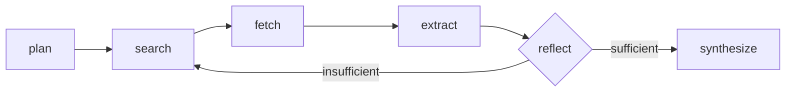

# Architecture

## The Graph



### Node Responsibilities

- **plan** — LLM decomposes the claim into 2–4 targeted search queries based on its key assertions
- **search** — runs each query against DuckDuckGo or Tavily, collects URLs + snippets
- **fetch** — downloads and extracts clean text from new URLs (capped per run, filters script/style/nav/footer)
- **extract** — LLM reads each page and tags evidence: does it support, refute, or stay neutral on the claim?
- **reflect** — LLM examines all gathered evidence and decides: confident enough to write a verdict, or search again with different queries?
- **synthesize** — LLM writes the final verdict (supported/refuted/mixed/unverified), confidence %, citations, and contradictions found across sources

Each step appends to a trace list carried through the entire run. The CLI `--trace` flag and the web UI's collapsible trace section show this step-by-step reasoning.

## Why a loop?

Most demo agents ask the LLM one question ("verify this claim") and trust the answer. This agent can decide it doesn't have enough signal and loop back. The reflect node is the key: it's where the LLM can say "I found one source, but it's weak — let me search again with a different query."

**Bounded by default:** `MAX_SEARCH_ITERATIONS=2` means search can run at most twice. This prevents infinite loops, bounds API costs, and forces the model to synthesize with what it has (resulting in `unverified` when evidence is thin, which is safer than guessing).

## Design Decisions

### JSON-in-prompt, not function-calling

Every structured output (`call_structured` in `llm.py`) asks the model for JSON in plain text and validates against a Pydantic schema. On parse failure, the raw output and validation error are fed back to the model once for a repair attempt.

**Why not use provider-native function calling?**
- OpenAI's structured outputs, Anthropic's tools, and Ollama's (lack of) native structured output are too different to abstract cleanly
- Small local models (3B params) sometimes struggle with abstract JSON-Schema syntax but follow concrete worked examples
- Building on the lowest common denominator (prompt + validation) means swapping `LLM_PROVIDER=ollama` to `=openai` requires only a `.env` change

### Provider interfaces

`SearchProvider` and `get_chat_model()` are abstraction points:

```python
# Swap search: just change .env
SEARCH_PROVIDER=duckduckgo      # no key needed
SEARCH_PROVIDER=tavily          # add TAVILY_API_KEY

# Swap LLM: just change .env
LLM_PROVIDER=ollama             # free, local
LLM_PROVIDER=openai             # add OPENAI_API_KEY
LLM_PROVIDER=anthropic          # add ANTHROPIC_API_KEY
```

No agent code changes. No conditional imports in the graph. Just `.env`.

### Iteration caps, not open-ended search

`MAX_SEARCH_ITERATIONS` (default 2) prevents:
- Unbounded API costs (especially with Tavily or OpenAI)
- Infinite loops on genuinely unanswerable claims
- Runaway inference on slow local models

When the cap is hit, `reflect` returns `sufficient` even if it's uncertain. The model then synthesizes with what it has, often resulting in `unverified`. This is the right failure mode: admitting uncertainty beats confidently guessing.

## State management

The graph state is a TypedDict with `Annotated` reducers for append-only fields:

```python
class State(TypedDict):
    claim: str
    queries_to_search: list[str]              # reducer: append
    search_results: list[SearchResult]        # reducer: append
    urls_to_fetch: list[str]                  # reducer: append
    fetched: dict[str, str]                   # reducer: append (as items)
    evidence: list[Evidence]                  # reducer: append
    trace: list[str]                          # reducer: append
    search_iterations_so_far: int
    ...
```

The reducers mean that each node doesn't overwrite previous results — it extends them. A node that calls `fetch` twice appends both results; the state accumulates evidence across multiple `extract` calls.

## Error handling

- **Fetch errors** — unreachable URLs, timeouts, non-HTML → reported in trace, doesn't crash the run
- **LLM parse failures** — invalid JSON from the model → repair attempt (one retry); if it fails again, the node fails with `LLMError`
- **Search errors** — DuckDuckGo rate-limiting → backoff and report; Tavily down → raises immediately
- **Graph errors** — node raises any other exception → the API returns 500 with the error message

## Testing

`tests/test_graph_smoke.py` runs the actual compiled LangGraph with a fake LLM, forcing the `reflect → search` loop to fire:

```python
def test_graph_loops_on_insufficient_evidence():
    # Fake LLM returns insufficient on first reflect, sufficient on second
    llm = FakeLLM(responder=mock_responder)
    search_provider = FakeSearchProvider(...)
    
    result = run_fact_check("claim", llm, search_provider, settings)
    
    # Verify search was called twice
    assert len(search_provider.queries_seen) == 4  # 2 per search node fire
```

Mocked tests can't catch real model behavior (they can't verify a real model actually reads the prompt). That's why there's also `eval/run_eval.py` which makes real LLM + search calls and reports accuracy — see [EVALUATION.md](EVALUATION.md) for results.

## Real bugs found (and why they matter)

Two bugs only surfaced during real eval with a live model (`llama3.2:3B`). Mocked tests passed.

### 1. Verdict/evidence direction mismatch

On "goldfish have a 3-second memory," the agent:
- Found sources showing goldfish remember for months ✓
- Tagged stance as `refutes` ✓
- Wrote summary: "contradicts the claim" ✓
- Filled verdict: `supported` ✗

**Fix:** Separated the synthesis prompt into "the evidence is real and well-sourced" and "the evidence supports the claim being true." Small models conflate these otherwise.

### 2. Schema echo instead of answer

Under thin evidence, `llama3.2` would return the raw JSON *Schema* (including `$defs`) instead of an instance:
```json
{
  "$defs": { "Verdict": { ... } },
  "verdict": { ... }
}
```

A greedy `\{.*\}` regex would span first `{` to *last* `}` and concatenate both blobs.

**Fixes:**
1. Balanced-brace scanner in `_extract_json()` — stops at the matching close brace, not the last one
2. Concrete worked examples in prompts instead of raw JSON-Schema dumps — a filled example is an easier target for small models than abstract meta-schemas

Both were confirmed fixed by re-running the exact same claims. This is why the README emphasizes concrete examples + validation, not hope that the model will guess the format correctly.
