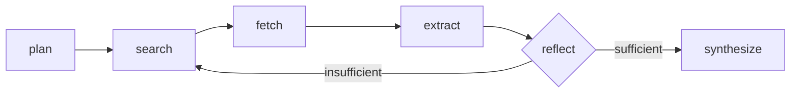

# Fact-Check Agent

A multi-step research agent that verifies a claim against live web sources —
plans search queries, searches, reads pages, extracts evidence, decides
whether it has enough, and only then commits to a verdict. Built to be the
opposite of "ask an LLM and trust the first answer": every claim in the
output is tied to a URL and a quote you can go check yourself.

Backs the "Web Research & Fact-Checking Agent" project on
[my portfolio](https://github.com/orackle/portfo).

## Why this exists

Most fact-checking demos are a single LLM call with a search tool bolted on.
The interesting engineering problem — and the reason this is a graph, not a
function — is that a model shouldn't be trusted to grade its own homework
after one search. This agent can decide it doesn't have enough evidence yet
and go search again, up to a configurable cap, before it's allowed to
synthesize a verdict.

## Architecture



- **plan** — LLM decomposes the claim into 2-4 targeted search queries.
- **search** — runs each pending query against the search backend (DuckDuckGo
  by default, no key required).
- **fetch** — downloads and extracts clean text from unfetched result URLs
  (capped per run).
- **extract** — LLM reads each new page and pulls a quote + stance
  (supports / refutes / neutral / irrelevant) relative to the claim.
- **reflect** — LLM looks at everything gathered and decides: is this enough
  to reach a confident verdict, or do we need another round with different
  queries? This is the actual agentic step — it's what makes `search`
  reachable twice in the graph above.
- **synthesize** — only reached once `reflect` says so (or the iteration cap
  is hit). Produces the final verdict, confidence, citations, and any
  contradictions found across sources.

Every step appends to a `trace` list carried through the whole run — pass
`--trace` on the CLI or read `trace` in the API response to see exactly what
the agent searched, fetched, and reasoned at each step.

### A few design decisions worth calling out

- **JSON-in-prompt, not provider function-calling.** Every structured output
  (`factcheck/llm.py::call_structured`) asks the model for JSON in plain text
  and validates it against a Pydantic schema, with one repair round-trip on
  a parse failure. Native structured-output APIs differ enough between
  OpenAI, Anthropic, and small local Ollama models that building on the
  lowest common denominator (a schema in the prompt) is what makes swapping
  `LLM_PROVIDER` actually work without touching the agent logic.
- **Search and LLM are both behind interfaces** (`SearchProvider`,
  `get_chat_model`). Swapping DuckDuckGo for Tavily, or a local Ollama model
  for GPT-4o-mini, is a `.env` change — see `.env.example`.
- **The loop is capped, not open-ended.** `MAX_SEARCH_ITERATIONS` (default 2)
  bounds how many times `reflect` can send the graph back to `search`, so a
  stubborn or unanswerable claim fails closed (verdict: `unverified`) instead
  of looping forever or burning unbounded API spend.

## Project structure

```
factcheck/
  agent/
    state.py      # the graph's shared TypedDict state
    nodes.py      # plan / search / fetch / extract / reflect / synthesize
    graph.py      # wires nodes into the LangGraph StateGraph + loop edge
  tools/
    search.py     # SearchProvider interface: DuckDuckGo (default), Tavily
    fetch.py      # page download + text extraction
  llm.py          # provider-agnostic chat model + JSON-in-prompt parsing
  config.py       # env-driven settings, .env loading
  schemas.py      # every Pydantic contract used across the codebase
  cli.py          # python -m factcheck.cli "<claim>"
  api.py          # FastAPI app: /health, /verify, serves static/ at "/"
static/
  index.html      # single-page frontend — talks to /verify directly
eval/
  dataset.jsonl   # 10 labeled claims for accuracy checks
  run_eval.py     # runs the agent over the dataset, reports accuracy
tests/            # 20 tests, fully mocked — see Testing below
```

## Frontend

`static/index.html` is a single self-contained page (no build step, no
framework) served by FastAPI at `/` — open it after starting the API and
you get a text box instead of `curl`:

- submits a claim to `/verify` and shows a rotating status line while the
  agent works ("Planning search queries…", "Reading sources…", …) since a
  real run can take 1-3+ minutes depending on the LLM backend
- renders the verdict as a color-coded badge (supported / refuted / mixed /
  unverified) with a confidence percentage
- lists every citation as a clickable source URL plus the exact quote that
  backs it, and any contradictions found across sources, not just a summary
  paragraph
- a collapsible "Show agent trace" section with the same step-by-step log
  the CLI's `--trace` flag prints — the point of this whole project is that
  you shouldn't have to trust the verdict blindly, so the reasoning trail is
  one click away, not hidden

Visually matches the ink/blueprint palette and IBM Plex type used on
[the portfolio](https://github.com/orackle/portfo) this backs, since the
intent is to eventually embed or link this directly from that "in progress"
project card.

## Setup

```bash
python -m venv .venv
source .venv/bin/activate   # .venv\Scripts\activate on Windows
pip install -r requirements-dev.txt
cp .env.example .env
```

Pick an LLM provider in `.env`:

- **Ollama (default, free, local)** — install [Ollama](https://ollama.com),
  run `ollama pull llama3.1`, leave `LLM_PROVIDER=ollama`. No API key needed.
  Note: on CPU-only hardware, small local models are genuinely slow —
  expect tens of seconds per structured call, so a full run (4-8 LLM calls)
  can take several minutes. Verified end-to-end on `llama3.2:3B` on CPU.
- **OpenAI / Anthropic** — set `LLM_PROVIDER=openai` or `anthropic`, add the
  matching API key. Much faster, costs money per run.

Search defaults to DuckDuckGo (no key). Set `SEARCH_PROVIDER=tavily` +
`TAVILY_API_KEY` for a search backend built for LLM agents (cleaner
snippets) once you have a key.

## Usage

```bash
python -m factcheck.cli "The Eiffel Tower is taller than the Statue of Liberty"
python -m factcheck.cli --json --trace "..."   # machine-readable, with full trace
```

Or run the API + frontend:

```bash
uvicorn factcheck.api:app --reload
```

- `http://localhost:8000/` — the web UI (see Frontend below)
- `http://localhost:8000/docs` — interactive Swagger UI for `/verify`
- or hit it directly:

```bash
curl -X POST localhost:8000/verify -H 'content-type: application/json' \
  -d '{"claim": "The Great Wall of China is visible from space with the naked eye"}'
```

## Testing

```bash
pytest
```

The suite (20 tests) mocks every external dependency — no network, no LLM,
no API keys required. `tests/test_graph_smoke.py` runs the *actual* compiled
LangGraph graph end-to-end with a scripted fake LLM, including forcing the
`reflect -> search` loop to fire once before synthesizing, which is the part
a pure unit test of individual nodes can't verify.

Passing mocked tests proves the wiring is correct; it doesn't prove a real
model can actually follow the prompts. That gap — and the two real bugs it
hid — is covered in "What broke in real runs" below.

## Evaluation

`eval/dataset.jsonl` has 10 hand-picked claims (clear true, clear false, and
one genuinely disputed statistic) with expected verdict labels. This makes
real LLM + search calls, so it's not part of CI-style testing — run it by
hand after changing prompts or switching models:

```bash
python -m eval.run_eval
python -m eval.run_eval --limit 3
```

### Real results (llama3.2:3B on CPU, DuckDuckGo search)

- **Accuracy:** 9/10 (90%) — only miss was Napoleon Bonaparte (expected refuted, got supported)
- **Per-claim timing:** 52–392s, average 271s (~4.5 minutes per claim)
- **Total run time:** ~45 minutes for full 10-claim set
- **Verdict scoring:** "unverified" treated as compatible with refuted/mixed since the model's conservative behavior (not finding evidence) is safer than false confidence

Details:
1. ✓ Eiffel Tower > Statue of Liberty (297s)
2. ✓ Great Wall not visible from space (392s)
3. ✓ Python by Guido van Rossum (362s)
4. ✓ Goldfish memory (unverified, acceptable for refuted) (271s)
5. ✓ Wright brothers 1903 (321s)
6. ✗ Napoleon height — model thought he was short; actually average for era (249s)
7. ✓ Mount Everest tallest (104s)
8. ✓ Humans 10% brain myth (unverified for refuted) (114s)
9. ✓ Amazon oxygen (unverified for mixed) (248s)
10. ✓ Lightning strikes same place (unverified for refuted) (52s)

## What broke in real runs (and why it's worth reading)

Mocked tests catch wiring bugs. They can't catch a real model behaving in
ways you didn't script into a fake. Two failures only showed up once this
was actually pointed at live search and a real local model (`llama3.2:3B`
via Ollama):

1. **Verdict/evidence direction mismatch.** On the claim "goldfish have a
   3-second memory," the agent correctly found a source stating goldfish
   retain memories for months, correctly tagged that evidence
   `stance=refutes`, and wrote a summary that literally said *"contradicts
   the claim"* — then filled the `verdict` field with `supported` anyway.
   Evidence gathering worked perfectly; the model just flipped the final
   label. Fixed by making the synthesis prompt explicitly separate "the
   evidence is real and well-sourced" from "the evidence supports the claim
   being true" — those are independent, and small models conflate them.

2. **Schema-echo instead of an answer.** Under thin evidence, the model
   would sometimes respond with the JSON *Schema* it was given (including
   `$defs`) instead of an actual instance of it — a `\{.*\}` regex spanning
   first `{` to *last* `}` then concatenated both into one invalid blob.
   Fixed two ways: a proper balanced-brace scanner in `_extract_json`
   (stops at the *matching* close brace, not the last one anywhere in the
   response), and replacing the raw JSON-Schema dump with a concrete worked
   example per call site — a filled-in example is a much easier target for
   a 3B model than an abstract meta-schema, which it would otherwise
   sometimes parrot back verbatim.

Both were confirmed fixed by re-running the exact same claims, not just by
reasoning about the code — see the commit history for the before/after
transcripts. This is also why `MAX_SEARCH_ITERATIONS`, output tokens, and
document size are capped by default: correctness on a 3B model degrades
with the length and abstractness of what you ask it to produce in one shot.

## Known limitations / roadmap

- No PDF or JS-rendered page support — `fetch` handles static HTML only,
  anything else comes back as a reported error rather than garbage text.
- No auth, rate limiting, or request queueing on the API — fine for a
  portfolio demo, not for real traffic.
- DuckDuckGo's free search is occasionally rate-limited; Tavily is the
  documented upgrade path when that matters.
- No dead-link checking on citations before they're returned.
- No streaming — the API blocks until the full graph finishes, which given
  the CPU-Ollama timing above can be a genuinely long wait. Worth adding
  SSE/streaming of the trace for a live demo embed.
