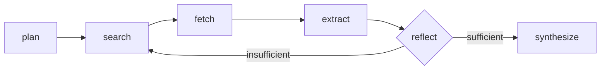

# Fact-Check Agent

A multi-step research agent that verifies a claim against live web sources —
plans search queries, searches, reads pages, extracts evidence, decides
whether it has enough, and only then commits to a verdict. Built to be the
opposite of "ask an LLM and trust the first answer": every claim in the
output is tied to a URL and a quote you can go check yourself.

Backs the "Web Research & Fact-Checking Agent" project on
[my portfolio](https://github.com/orackle/portfo).

## Why this exists

Most fact-checking demos are a single LLM call with a search tool bolted on.
The interesting engineering problem — and the reason this is a graph, not a
function — is that a model shouldn't be trusted to grade its own homework
after one search. This agent can decide it doesn't have enough evidence yet
and go search again, up to a configurable cap, before it's allowed to
synthesize a verdict.

## Architecture



- **plan** — LLM decomposes the claim into 2-4 targeted search queries.
- **search** — runs each pending query against the search backend (DuckDuckGo
  by default, no key required).
- **fetch** — downloads and extracts clean text from unfetched result URLs
  (capped per run).
- **extract** — LLM reads each new page and pulls a quote + stance
  (supports / refutes / neutral / irrelevant) relative to the claim.
- **reflect** — LLM looks at everything gathered and decides: is this enough
  to reach a confident verdict, or do we need another round with different
  queries? This is the actual agentic step — it's what makes `search`
  reachable twice in the graph above.
- **synthesize** — only reached once `reflect` says so (or the iteration cap
  is hit). Produces the final verdict, confidence, citations, and any
  contradictions found across sources.

Every step appends to a `trace` list carried through the whole run — pass
`--trace` on the CLI or read `trace` in the API response to see exactly what
the agent searched, fetched, and reasoned at each step.

### A few design decisions worth calling out

- **JSON-in-prompt, not provider function-calling.** Every structured output
  (`factcheck/llm.py::call_structured`) asks the model for JSON in plain text
  and validates it against a Pydantic schema, with one repair round-trip on
  a parse failure. Native structured-output APIs differ enough between
  OpenAI, Anthropic, and small local Ollama models that building on the
  lowest common denominator (a schema in the prompt) is what makes swapping
  `LLM_PROVIDER` actually work without touching the agent logic.
- **Search and LLM are both behind interfaces** (`SearchProvider`,
  `get_chat_model`). Swapping DuckDuckGo for Tavily, or a local Ollama model
  for GPT-4o-mini, is a `.env` change — see `.env.example`.
- **The loop is capped, not open-ended.** `MAX_SEARCH_ITERATIONS` (default 2)
  bounds how many times `reflect` can send the graph back to `search`, so a
  stubborn or unanswerable claim fails closed (verdict: `unverified`) instead
  of looping forever or burning unbounded API spend.

## Setup

```bash
python -m venv .venv
source .venv/bin/activate   # .venv\Scripts\activate on Windows
pip install -r requirements-dev.txt
cp .env.example .env
```

Pick an LLM provider in `.env`:

- **Ollama (default, free, local)** — install [Ollama](https://ollama.com),
  run `ollama pull llama3.1`, leave `LLM_PROVIDER=ollama`. No API key needed.
  Note: on CPU-only hardware, small local models are genuinely slow —
  expect tens of seconds per structured call, so a full run (4-8 LLM calls)
  can take several minutes. Verified end-to-end on `llama3.2:3B` on CPU.
- **OpenAI / Anthropic** — set `LLM_PROVIDER=openai` or `anthropic`, add the
  matching API key. Much faster, costs money per run.

Search defaults to DuckDuckGo (no key). Set `SEARCH_PROVIDER=tavily` +
`TAVILY_API_KEY` for a search backend built for LLM agents (cleaner
snippets) once you have a key.

## Usage

```bash
python -m factcheck.cli "The Eiffel Tower is taller than the Statue of Liberty"
python -m factcheck.cli --json --trace "..."   # machine-readable, with full trace
```

Or run the API:

```bash
uvicorn factcheck.api:app --reload
curl -X POST localhost:8000/verify -H 'content-type: application/json' \
  -d '{"claim": "The Great Wall of China is visible from space with the naked eye"}'
```

## Testing

```bash
pytest
```

The suite (18 tests) mocks every external dependency — no network, no LLM,
no API keys required. `tests/test_graph_smoke.py` runs the *actual* compiled
LangGraph graph end-to-end with a scripted fake LLM, including forcing the
`reflect -> search` loop to fire once before synthesizing, which is the part
a pure unit test of individual nodes can't verify.

## Evaluation

`eval/dataset.jsonl` has 10 hand-picked claims (clear true, clear false, and
one genuinely disputed statistic) with expected verdict labels. This makes
real LLM + search calls, so it's not part of CI-style testing — run it by
hand after changing prompts or switching models:

```bash
python -m eval.run_eval
python -m eval.run_eval --limit 3
```

## Known limitations / roadmap

- No PDF or JS-rendered page support — `fetch` handles static HTML only,
  anything else comes back as a reported error rather than garbage text.
- No auth, rate limiting, or request queueing on the API — fine for a
  portfolio demo, not for real traffic.
- DuckDuckGo's free search is occasionally rate-limited; Tavily is the
  documented upgrade path when that matters.
- No dead-link checking on citations before they're returned.
- No streaming — the API blocks until the full graph finishes, which given
  the CPU-Ollama timing above can be a genuinely long wait. Worth adding
  SSE/streaming of the trace for a live demo embed.
